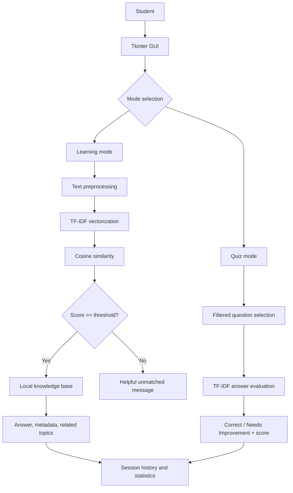
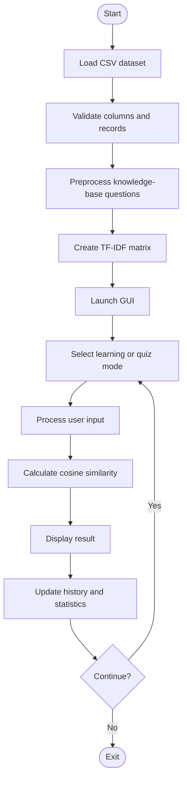
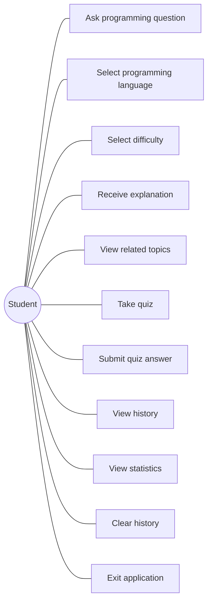

# CodeMentor AI — Architecture Notes

## ASCII architecture

```text
Student
  |
  v
Tkinter GUI
  |
  +--> Learning Mode --> Preprocessing --> TF-IDF --> Cosine Similarity
  |                                      |              |
  |                                      +--------------v
  |                                             Best match + threshold
  |                                                     |
  |                                                     v
  |                                           Local programming KB
  |                                                     |
  |                                                     v
  |                                      Educational response + related topics
  |
  +--> Quiz Mode --> Question selection --> Answer preprocessing
                                           --> TF-IDF + cosine similarity
                                           --> Result + score
  |
  +--> Session history and statistics
```

## Mermaid architecture



## Flowchart



## UML / use case



## Data flow diagrams

### Level 0

```text
Student --> [CodeMentor AI] --> Response / Quiz Result
                 ^
                 |
       Local Knowledge Base
```

### Level 1

```text
Student
  |
  v
1. GUI input and filters
  |
  v
2. Text preprocessing <--> local stopwords / optional NLTK lemmatizer
  |
  v
3. TF-IDF + cosine similarity <--> programming_qa.csv
  |
  +--> 4a. Learning response
  |
  +--> 4b. Quiz evaluation
  |
  v
5. Session history and statistics
  |
  v
Student
```